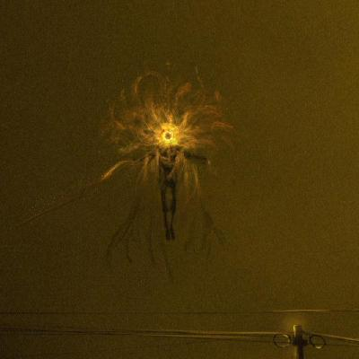
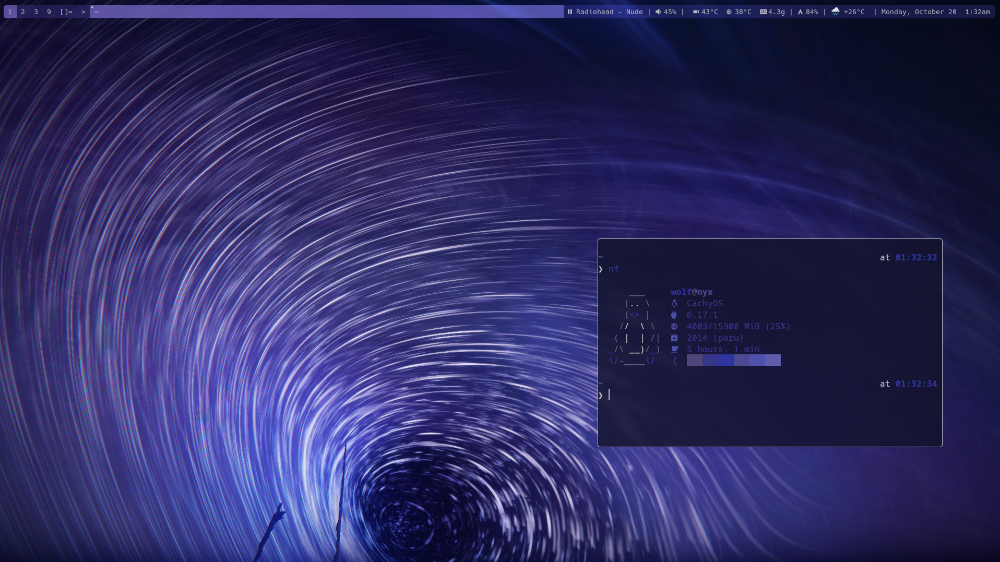

<h2 align="center">phoenyx-dwm </h2>

<h2 align="center">
      
    
</h2>

## my build of dwm, the tiling wm that sucks less
- `dwm` is an elegant, minimalist, enthusiast x11 window manager that sucks less.
- configured entirely through modifying the source code, `dwm` is a blast to sift through, and teaches you tons about `c`.

## patches
- [actualfullscsreen](https://dwm.suckless.org/patches/actualfullscreen/)
    - changes fullscreen behaviour into actual fullscreen instead of bartoggle+monocle
- [alpha](https://dwm.suckless.org/patches/alpha/)
    - allows statusbar and window borders to be transparent
- [bar-height-spacing](https://dwm.suckless.org/patches/bar_height/)
    - lets you set the height of the bar
- [barpadding](https://dwm.suckless.org/patches/barpadding/)
    - adds padding around the edges of the bar
- [cool_autostart](https://dwm.suckless.org/patches/cool_autostart/)
    - implements autostart functionality controllable through `config.def.h`
- [focusmonmouse](https://dwm.suckless.org/patches/focusmonmouse/)
    - makes the mouse pointer follow focus change to a different output
- [fullgaps](https://dwm.suckless.org/patches/fullgaps/)
    - adds controllable gaps between windows
- [hide_vacant_tags](https://dwm.suckless.org/patches/hide_vacant_tags/)
    - hides the tags that don't have a window from the bar
- [restartsig](https://dwm.suckless.org/patches/restartsig/)
    - adds a keybinding to restart dwm inplace
- [statusallmons](https://dwm.suckless.org/patches/statusallmons/)
    - shows the status portion of the bar on all outputs instead of only the focused one
- [windowfollow](https://dwm.suckless.org/patches/windowfollow/)
    - makes focus follow a window that's been sent to a different tag

## statusbar
- standard `dwm` bar
- using `dwmblocks-async` for status information

## continuous integration
- every push or PR triggers a github action.
- it uses `make` to build the project, making substitutions for `pywal16` generated colours.
